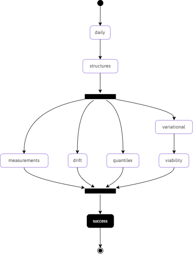

**Links**

* [The Artificial Intelligence Unit](https://github.com/theartificialintelligenceunit)

 
 

    

 
 

 
 

 
 

 
 

<!--

<b>Notes</b>

<ul>
  <li>configurations: Records data & modelling configurations.</li>
  <li>iac: Infrastructure as code scripts.</li>
</ul>

-->

