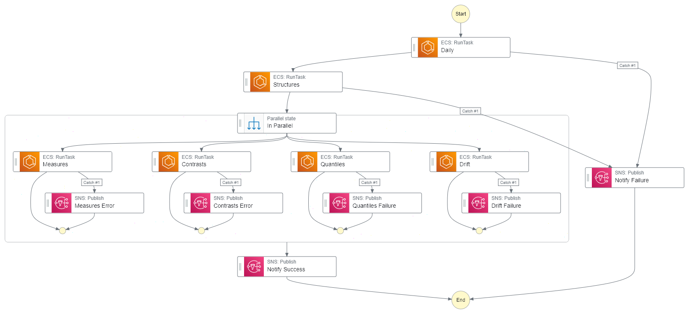

[The Artificial Intelligence Unit](https://github.com/theartificialintelligenceunit)

 

This hub host's the repositories of the <a href="https://theartificialintelligenceunit.github.io/intelligence/html/in-river-predictions.html">river levels intellligence pages</a>.  

 

<b>Notes</b>

 
 

<h2>PERIODIC</h2>

Schedule: Once a week

    

 
 

<h2>CONTINUOUS</h2>

Schedule: 6 days a week

    

 
 

 
 

 
 

 
 

<!--

<b>Notes</b>

<ul>
  <li>configurations: Records data & modelling configurations.</li>
  <li>iac: Infrastructure as code scripts.</li>
</ul>

-->

